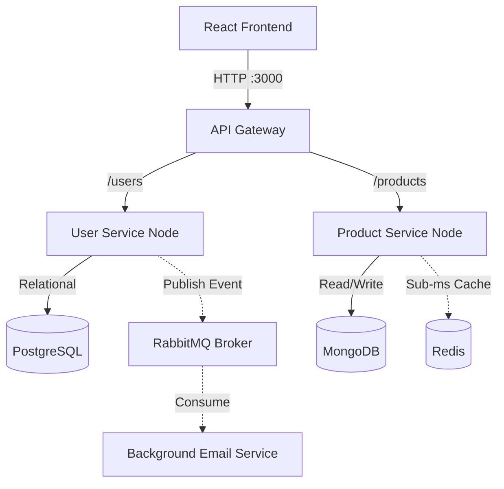

# MicroStore: Enterprise Microservices Architecture


A production-grade, highly scalable e-commerce architecture built to demonstrate robust backend practices. This project completely isolates services, manages data inside multi-model databases, utilizes in-memory caching for performance, and communicates asynchronously via message brokers.

## 🌟 Core Features

- **API Gateway Pattern:** Centralized routing built natively securely with Express and `http-proxy-middleware`.
- **Stateless JWT Authentication:** Secure login flow utilizing Bcrypt cryptography and Bearer tokens dynamically protecting modifying routes.
- **Polyglot Persistence Layer:** 
  - `PostgreSQL` for strict, relational User data.
  - `MongoDB` for flexible, schema-less Product catalogs.
- **Advanced In-Memory Caching:** Radically fast sub-millisecond responses utilizing **Redis** to intercept cached product fetches and bypassing disk I/O.
- **Event-Driven Messaging:** Zero-latency background workers reliably process events (like Welcome Emails) asynchronously via the **RabbitMQ** pipeline broker.
- **Role-Based Access Control (RBAC):** Secure `is_admin` flags dynamically unlock an exclusive Administrative Dashboard sidebar within the React UI.
- **Stunning React SPA:** A modern, premium glassmorphism storefront built natively on Vite.
- **Automated CI/CD:** Complete continuous integration defined purely in GitHub Actions (`.github/workflows`) strictly validating entire cluster health before code merges.

## 🏗️ Architecture Flow



## 🚀 Quick Start (Docker)

To run this entire 6-container stack locally on your machine identically with a single command, you must have [Docker Desktop](https://www.docker.com/) installed on your machine.

1. **Clone the repository**
   ```bash
   git clone https://github.com/kernelfatima/Microservices.git
   cd Microservices
   ```

2. **Spin up the cluster**
   ```bash
   docker-compose up -d --build
   ```

3. **Access the application**
   - Head over to `http://localhost:5173` to interact with the React frontend.
   - The API Gateway handles routes on `http://localhost:3000`.
   - The RabbitMQ worker nodes output telemetry that can be monitored via Docker logs.

## 🧪 Validating the Advanced Features
- **Admin Dashboard:** Register an account natively with an email starting dynamically with `admin` or `boss` (e.g., `boss@example.com`). The backend automatically grants you Superuser DB roles resulting in a secure Admin Sidebar mysteriously appearing!
- **RabbitMQ Workers:** Register any normal user, then run `docker logs email-service` in your terminal to securely verify that the independent email worker safely caught the queue hook in real-time.
- **Redis Caching:** Refresh the catalog page multiple times. The first fetch hits MongoDB, but subsequent fetches bypass databases and pull directly from Redis RAM.
